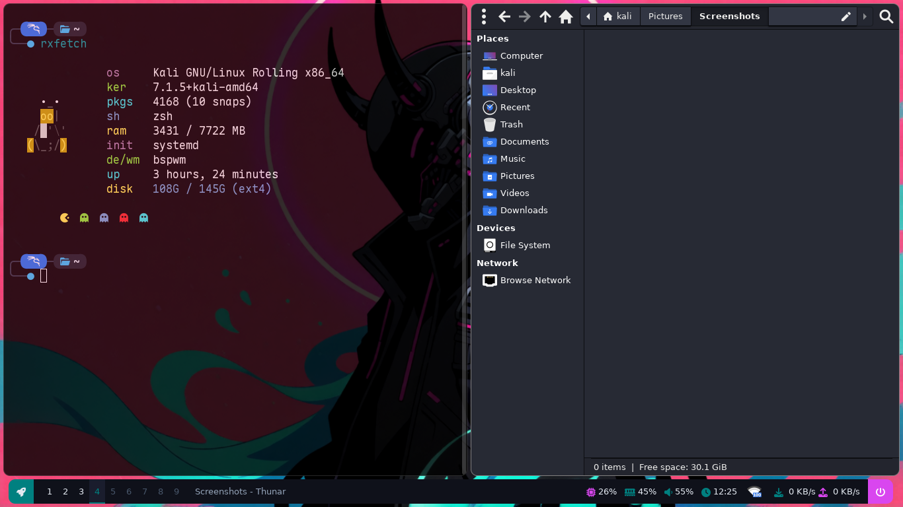

# dotfiles

```
sudo apt install bspwm rofi polybar picom sxhkd nm-applet feh starship thunar
cp .config/* ~/.config/
mkdir -p ~/Pictures/wallpapers && cp -r wallpapers/* ~/Pictures/wallpapers
```

